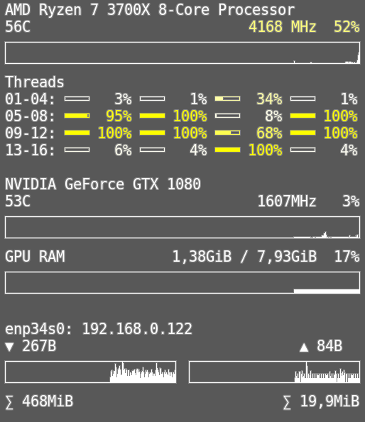

# ConkyConfig
## Intro
This is an important part of my conky configuration. It is not complete, but you can customize it to your liking.
## Additional Infos
The amount of threads are detected automatically. There are variables to change the width of conky in `conky.conf`. `inceptionGetCpu` needs a resolution specific width (`inceptionGetCpuWidth`), which I made by using GIMP and counting the pixels. `inceptionGetCpuWidth` is the width of the thread bars. The load color can be changed to red or otherwise.\
The GPU part uses `nvidia-smi` to get the information about one GPU.\
The network part will show one network with the name of `enp.*` (LAN) and one with `wlp.*` (WLAN) when available. This needs to be changed if the cards are named something else or more are installed.
## Preview

